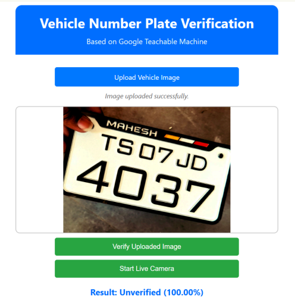

---

# Vehicle Number Plate Compliance Detection

## Project Overview

This project implements an AI-based system to automatically detect whether vehicle number plates comply with government regulations using image classification. The system helps identify non-compliant or customized number plates that do not follow the standardized font and style mandated by the government.



---

## Features

* Upload vehicle number plate images for analysis
* Classifies number plates as compliant or non-compliant
* Uses a trained AI model based on Google Teachable Machine


---

## Dataset

* Primary data collected via image uploads
* Secondary data sourced from Kaggle
* Dataset includes images of number plates under various conditions

---

## Tools & Technologies

* Google Teachable Machine for model training
* TensorFlow\.js for running the model directly in the browser
* HTML, CSS, JavaScript for frontend web development

---

## How It Works

1. User visits the website and uploads a number plate image.
2. The image is processed in-browser by the AI model to check compliance.
3. The website displays whether the number plate follows government rules or not.

---

## Installation & Usage

1. **Clone the repository:**

   ```bash
   git clone https://github.com/your-username/number-plate-compliance.git
   cd number-plate-compliance
   ```

2. **Open the `index.html` file in your browser:**

   ```bash
   start index.html     # Windows
   open index.html      # macOS
   xdg-open index.html  # Linux
   ```

3. **Upload a number plate image** using the interface and get real-time compliance results.
   The AI model will evaluate the uploaded image and label it as **Compliant** or **Non-Compliant**.

---

## Folder Structure

```
number-plate-compliance/
├── images/                # Sample images for demo
├── model/                 # Teachable Machine exported model files
├── index.html             # Main webpage
├── style.css              # Styling for the webpage
├── script.js              # JavaScript to load and run the model
└── README.md              # Project documentation
```
