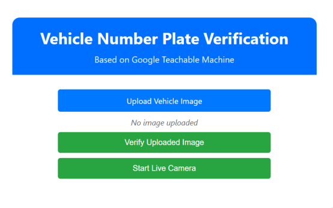

# Vehicle Number Plate Compliance Detection

## Overview

This project utilizes AI-powered image classification to determine whether vehicle number plates comply with government regulations. It aims to identify non-standard or customized number plates that deviate from prescribed fonts and styles.

## Features

- Upload vehicle number plate images for real-time analysis
- AI-based classification of number plates as **Compliant** or **Non-Compliant**
- Built using **Google Teachable Machine** for model training

## Dataset

- Primary dataset collected via user image uploads
- Secondary dataset sourced from Kaggle
- Images include varied conditions for robust training

## Technologies Used

- **Google Teachable Machine** for AI model training
- **TensorFlow.js** to run the model in-browser
- **HTML, CSS, JavaScript** for frontend development

## How It Works

1. Users visit the website and upload a number plate image.
2. The AI model processes the image in-browser to assess compliance.
3. The system displays results indicating whether the plate conforms to regulations.

## Screenshots

### Example Number Plate Classification


### Website User Interface


## Installation & Usage

1. **Clone the repository:**
   ```bash
   git clone https://github.com/your-username/number-plate-compliance.git
   cd vehicle-number-plate-verification
   ```

2. **Launch the website:**
   ```bash
   start index.html     # Windows
   open index.html      # macOS
   xdg-open index.html  # Linux
   ```

3. **Analyze number plate images** by uploading them via the interface.
   The AI model will classify the uploaded image as **Compliant** or **Non-Compliant**.

## Folder Structure

```
number-plate-compliance/
├── images/              # Sample images for demo
│   ├── image1.png       # Example number plate
│   └── image2.png       # Website UI screenshot
├── index.html           # Main webpage
├── style.css            # Webpage styles
├── script.js            # JavaScript for AI model
└── README.md            # Project documentation
```

---

